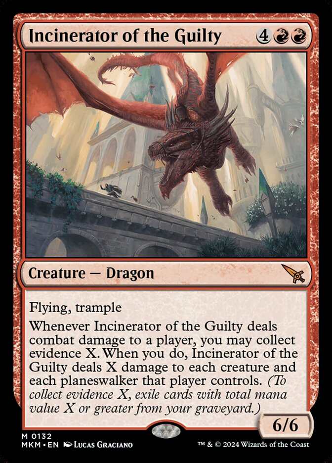
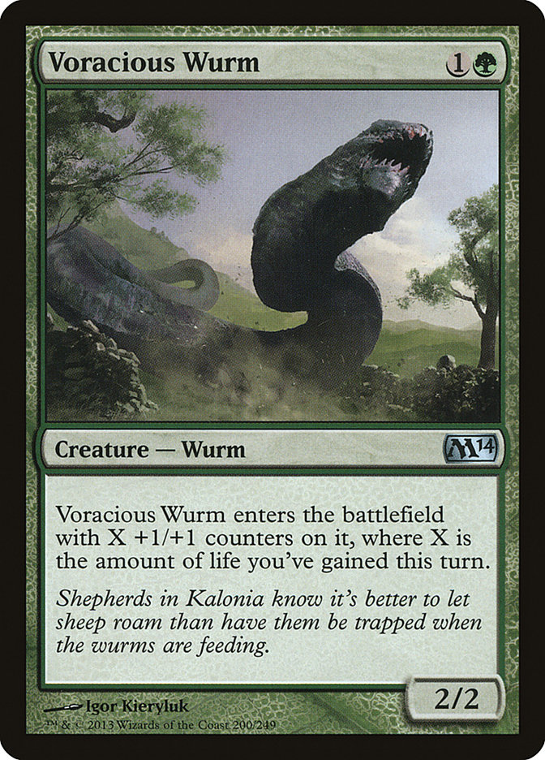
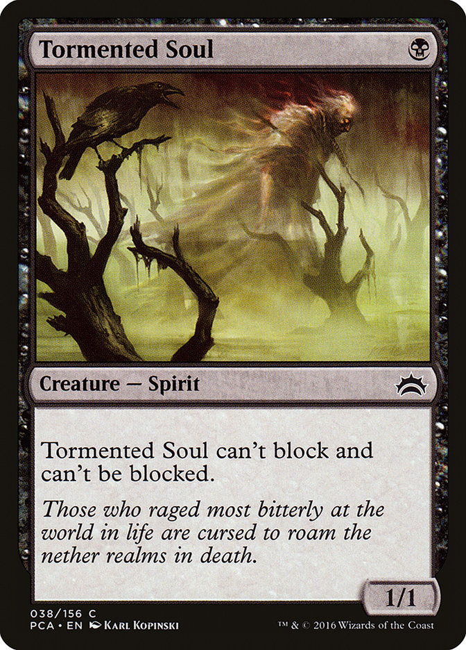
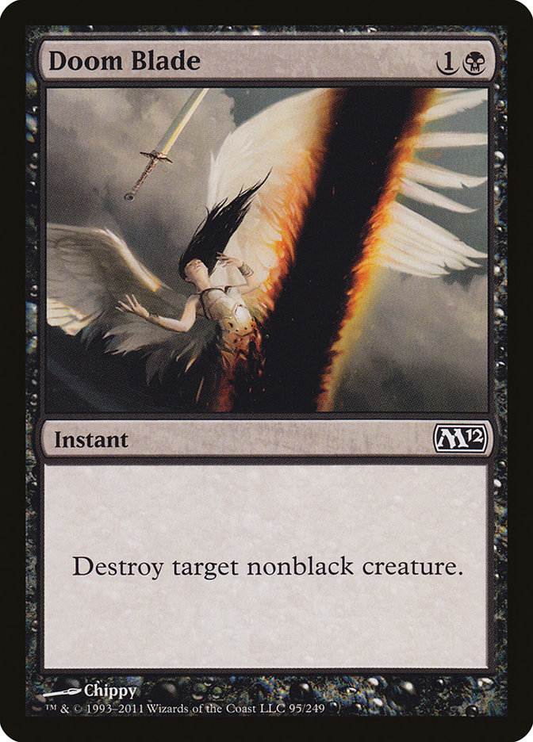
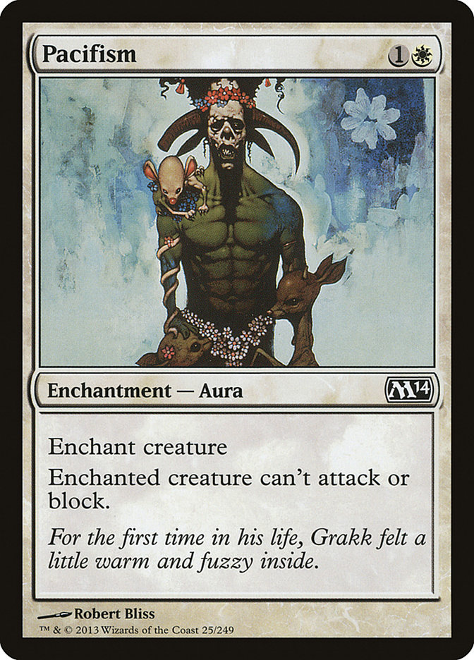
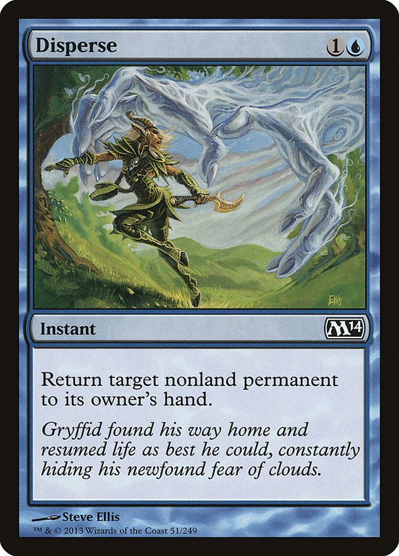
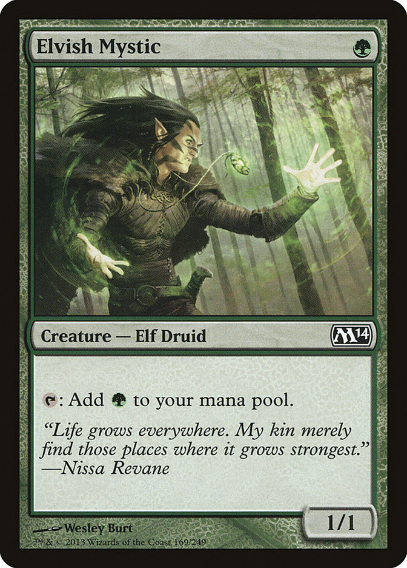
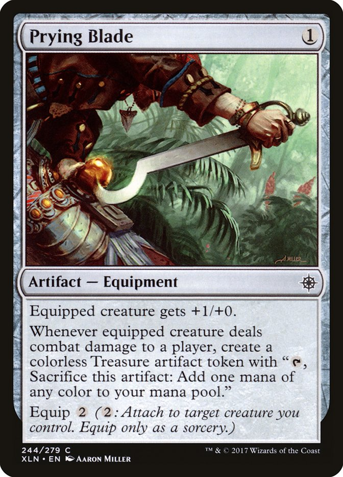
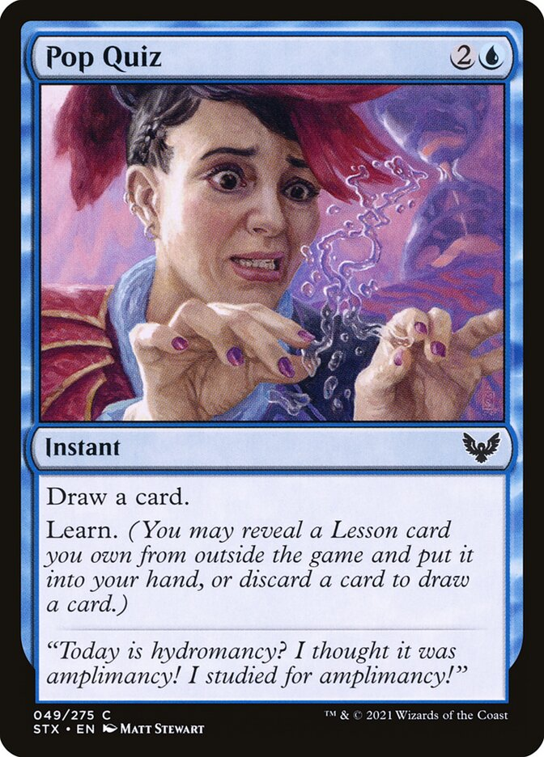

# Drafting Guide
## Intro
Drafting can be a daunting proposition for any new Magic player, having to learn both the deck construction and play aspects simultaneously, however the [Mini Starter Cube](https://archidekt.com/decks/22490665/mini_starter_cube) attempts to provide a beginner friendly experience enabling new players to enjoy Magic's many worlds! It's card pool has been selected from across the Magic multiverse to demonstrate a wide array of art, mechanics, and flavour whilst also not breaking too far from the standard roles of each colour. This reflects my own personal view of 'what Magic is' containing lots of instant speed trickery, graveyard synergy, and evasive creatures - for Wizards of the Coast's opinion on the subject I would instead guide you towards [Finnegan's (2024) Foundations Prerelease Guide](https://magic.wizards.com/en/news/feature/foundations-prerelease-guide). 

The rest of this guide will walk players through exactly what to expect from the cube, explaining what drafting is, providing deck building tips, and describing the archetypes present. Please note however this is not a guide on how to actually play Magic, this resource focuses entirely on the drafting components present before actual play. For resources on actual play I would recommend [Wizards of the Coast's (2026a) How to Play? guide](https://magic.wizards.com/en/how-to-play).

## What is Drafting? 
Draft is a term that broadly covers many Magic formats in which players create decks by taking turns selecting cards from a collective pool (MTG Wiki, 2025; Tolarian Community College, 2017). This collective pool might be a set number of purchased 'boosters' as is the case with Booster Draft or the more recently created Pick-Two Draft (Wizards of the Coast, 2026b; Wizards of the Coast, 2026c), however some players have created their own collections of cards to draft from, known as 'cubes' (MTG Wiki, 2026a; Tolarian Community College, 2023).

The [Mini Starter Cube](https://archidekt.com/decks/22490665/mini_starter_cube) is one such example. It is a comparatively small cube (hence 'mini') suggested for no more than 4 players. Whilst any rule-set might be used to draft the cube, the Pick-Two Draft (Wizards of the Coast, 2026c) approach is recommended, explained with the following points: 
1. Each player should receive 14 randomly selected cards from the cube. 
2. Each player should then select two cards from their received set, before passing the remaining to the player on their left - repeat until all received cards have been selected.
3. Each player should then receive a second set of 14 randomly selected cards from the cube, repeating the process until all cards from the cube have been selected.

By the end of this process each player should have a minimum of 42 cards (+ any number of basic lands) from which to build a 40 card deck, however players should have some idea of the deck they are trying to make during drafting. This does not mean rigidly sticking to a predetermined deck idea, but instead attempting to pick cards with a common theme or goal as guided by the remainder of this document. 

## Deck Building
With a basic understanding of what draft is you may now want a better understanding of deck construction and further guidance on what individual cards to pick, enabling you to create viable deck for play. This section will provide some general drafting tips, as well as more specific guidance reliant to the [Mini Starter Cube](https://archidekt.com/decks/22490665/mini_starter_cube). 

### Choosing your Colours
One of the first decisions you will have to make when drafting is selecting the colours of your deck. While this will be heavily determined by your first couple of card choices as guided by the advice in the remainder of this section, it might be useful to have some understanding of what you should be building towards. The [Mini Starter Cube](https://archidekt.com/decks/22490665/mini_starter_cube) is built with two coloured decks in mind and it is recommended first time players stick to this approach - however don't worry too much if you have to pivot, colour parings were created with overlap in mind and it is more important to stay flexible when drafting than it is to create the "perfect" deck.

If you are still unsure on how you should approach deck colour it may be helpful to explore the draft archetypes detailed in the [last section](./drafting_guide.md#draft-archetypes) of this document.

### Threats, Removal, and Value
When considering what cards to take when drafting, the categories of descending importance should be considered: threats, removal, value.

Threats

Threats are the cards that win games by threatening your opponents life total (Duke, 2014; MTG Wiki, 2026b) these will primarily be creatures think massive dragons, voracious wurms, or relentless spirits. While the <a src="https://archidekt.com/decks/22490665/mini_starter_cube">Mini Starter Cube</a> has relatively few creatures as compared to other draft environments you should still aim to include as many threats as possible in your deck: general guidance is 16-18 depending on your deck's goals and relative mana costs (schaab214, 2021).  

(Graciano, Wizards of the Coast, and Scryfall, 2024)

(Kieryluk, Wizards of the Coast, and Scryfall, 2013)

(Kopinski, Wizards of the Coast, and Scryfall, 2016)

  

Removal

Removal is how you responded to your opponents threats to prevent them from winning (Duke, 2014; Finnegan, 2025; MTG Wiki, 2026c), for example killing your opponents huge dragon with a cheap destroy spell such as Doom Blade. Each colour handles removal differently and some are better than others, however within the <a src="https://archidekt.com/decks/22490665/mini_starter_cube">Mini Starter Cube</a> all colours have fairly even access to removal. Removal is more important for slower decks, although all decks should include a reasonable amount, general guidance is 2-3 (schaab214, 2021). 

(Chippy, Wizards of the Coast, and Scryfall, 2011)

(Bliss, Wizards of the Coast, and Scryfall, 2013)

(Ellis, Wizards of the Coast, and Scryfall, 2013)

 

Value

Value cards help you cast other your other cards, either by drawing them sooner or giving you more mana to cast them. As with other categories the amount value cards needed will be dependent on the deck you are trying to make, if you aim to cast many spells with in a turn you might need to draw more cards to keep up card advantage or if your trying to cast big creatures you may need more mana to actually get them out. You might find it difficult to fit these 'value' cards into your very limited 40 card dark, however note that cards can fit into multiple categories: cards such as Elvish Mystic are both creatures that can threaten your opponents life total and value engines providing extra mana.

(Burt, Wizards of the Coast, and Scryfall, 2013)

(Miller, Wizards of the Coast, and Scryfall, 2017)

(Stewart, Wizards of the Coast, and Scryfall, 2021)

  

 

### Deck Construction 

## Draft Archetypes